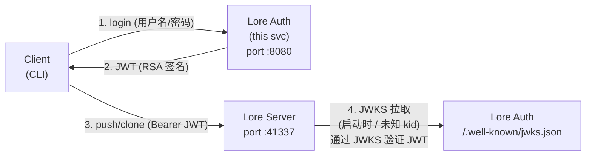

# Lore Auth Service

基于 TypeScript + Bun.js 的 JWT 认证服务，为 Epic Games [Lore VCS](https://github.com/EpicGames/lore) 提供 JWT 签发与 JWKS 端点。

[English](README.md)

## 工作原理



1. 客户端用用户名密码登录 Lore Auth，拿到 JWT
2. 客户端拿 JWT 作为 Bearer token 去 push/clone Lore Server
3. Lore Server 启动时从 Lore Auth 的 JWKS 端点拉取公钥，验证 JWT 签名
4. Lore Server 从已验证的 session 派生 partition（仓库隔离边界），客户端无法越权

## 快速开始

### 前置条件

- Bun >= 1.3 (https://bun.sh)

### 安装依赖

```bash
cd lore-auth
bun install
```

### 首次启动（自动 bootstrap 管理员）

```bash
# 方式一: bootstrap 命令
bun run bootstrap

# 方式二: 首次启动自动检测空库 -> 创建 admin
bun run start
```

默认管理员 `admin / changeme`，可通过环境变量或 `.env` 文件自定义：

```bash
cp .env.example .env
# 编辑 .env...
```

### 日常启动

```bash
bun run start
# 或开发模式 (热重载)
bun run dev
```

### 验证

```bash
# 1. 健康检查
curl http://localhost:8080/health_check

# 2. JWKS 端点 (Lore Server 会拉这个)
curl http://localhost:8080/.well-known/jwks.json

# 3. 登录拿 token
curl -X POST http://localhost:8080/auth/login \
  -H "Content-Type: application/json" \
  -d '{"username":"admin","password":"changeme"}'

# 4. 验证 token
curl http://localhost:8080/auth/me \
  -H "Authorization: Bearer <token>"

# 5. 创建新用户 (需要 admin token)
curl -X POST http://localhost:8080/admin/users \
  -H "Authorization: Bearer <admin-token>" \
  -H "Content-Type: application/json" \
  -d '{"username":"alice","password":"alice123","is_admin":false}'

# 6. 列出用户
curl http://localhost:8080/admin/users \
  -H "Authorization: Bearer <admin-token>"

# 7. 删除用户
curl -X DELETE http://localhost:8080/admin/users/alice \
  -H "Authorization: Bearer <admin-token>"
```

### 便捷签发测试 token

```bash
# 直接输出一个 JWT 到 stdout，适合管道传给其他工具
bun run src/index.ts --token-for=admin
```

## Docker 部署

### 使用 docker-compose（推荐）

```bash
# 构建并后台启动
docker-compose up -d

# 查看日志
docker-compose logs -f

# 停止并移除容器
docker-compose down
```

#### 使用 GitHub Container Registry 预构建镜像

默认 `docker-compose.yml` 会在本地构建镜像。你也可以切换到 GitHub Actions 自动发布到 ghcr.io 的预构建镜像 —— 具体用法见 `docker-compose.yml` 中注释掉的 `image:` 行。

```yaml
services:
  lore-auth:
    # image: ghcr.io/arnochenfx/lore-auth-service:latest
    # image: ghcr.io/arnochenfx/lore-auth-service:v1.0.0
```

当 `main` 分支推送了 `vX.X.X` 格式标签时，CI 会自动构建并发布镜像。也可以直接拉取：

```bash
docker pull ghcr.io/arnochenfx/lore-auth-service:latest
```

compose 文件挂载了两个命名 volume 做持久化：

| Volume | 容器路径 | 内容 |
|--------|----------|------|
| `lore-auth-keys` | `/app/keys` | RSA 密钥对，删掉就轮换密钥 |
| `lore-auth-data` | `/app/data` | SQLite 数据库 |

首次启动前在 `docker-compose.yml` 里改环境变量，至少改 `ADMIN_PASSWORD`：

```yaml
environment:
  ADMIN_USERNAME: "admin"
  ADMIN_PASSWORD: "your-secure-password"
  JWT_ISSUER: "http://your-host:8080"  # 必须是 Lore Server 能访问到的地址
```

### 使用 docker build + run

```bash
# 构建镜像
docker build -t lore-auth .

# 用命名 volume 持久化密钥和数据
docker run -d \
  --name lore-auth \
  -p 8080:8080 \
  -e ADMIN_PASSWORD=your-secure-password \
  -e JWT_ISSUER=http://your-host:8080 \
  -v lore-auth-keys:/app/keys \
  -v lore-auth-data:/app/data \
  --restart unless-stopped \
  lore-auth
```

### 验证容器

```bash
# 健康检查
curl http://localhost:8080/health_check

# 登录
curl -X POST http://localhost:8080/auth/login \
  -H "Content-Type: application/json" \
  -d '{"username":"admin","password":"your-secure-password"}'
```

### Docker 中的密钥轮换

```bash
# 停容器
docker-compose down

# 删掉密钥 volume（下次启动会重新生成密钥对）
docker volume rm lore-auth-keys

# 重新启动，新密钥对生成，所有旧 token 失效
docker-compose up -d
```

### Lore Server 连接 Docker 化的 Lore Auth

把 Lore Server 的 `jwt_issuer` 和 JWK endpoint 指向容器可达的地址。如果 Lore Server 也在 Docker 里跑，把两个服务放在同一个 Docker 网络，用容器名做 hostname：

```toml
[server.auth]
jwt_issuer = "http://lore-auth:8080"
jwt_audience = ["lore-service"]

[server.auth.jwk]
endpoint = "http://lore-auth:8080/.well-known/jwks.json"
```

## 配置 Lore Server

在 Lore Server 的 `local.toml` 里添加：

```toml
[server.auth]
jwt_issuer = "http://localhost:8080"
jwt_audience = ["lore-service"]

[server.auth.jwk]
endpoint = "http://localhost:8080/.well-known/jwks.json"
```

启动 Lore Server 后，它会从 Lore Auth 拉取 JWKS 公钥，对每个 gRPC 请求的 JWT 做签名验证。未携带有效 JWT 的请求直接拒绝。

对应的环境变量覆盖（等价于上面的 TOML）：

```bash
LORE__SERVER__AUTH__JWT_ISSUER=http://localhost:8080
LORE__SERVER__AUTH__JWK__ENDPOINT=http://localhost:8080/.well-known/jwks.json
# jwt_audience 是数组，只能从 TOML 文件配置，不能用环境变量
```

## API 一览

| 方法 | 路径 | 认证 | 说明 |
|------|------|------|------|
| GET | `/.well-known/jwks.json` | 无 | JWKS 端点，供 Lore Server 验签用 |
| GET | `/health_check` | 无 | 健康检查 |
| POST | `/auth/login` | 无 | 用户名密码登录，返回 access + refresh token |
| POST | `/auth/refresh` | 无 | 用 refresh token 换取新的 access token |
| GET | `/auth/me` | Bearer | 验证当前 token，返回用户信息 |
| GET | `/admin` | 无 | 浏览器端管理员面板，管理用户 |
| POST | `/admin/users` | Bearer (admin) | 创建用户 |
| GET | `/admin/users` | Bearer (admin) | 列出所有用户 |
| DELETE | `/admin/users/:username` | Bearer (admin) | 删除用户 |

### 管理员面板

在浏览器打开 `http://localhost:8080/admin`，使用 admin 账号登录后即可在页面上列出、创建和删除用户，无需使用 `curl`。页面会自动在后台刷新过期的 access token。

### Refresh Token

`/auth/login` 会同时返回 `access_token`（默认 1 小时有效）和 `refresh_token`（默认 7 天有效）。access token 过期后，调用 `POST /auth/refresh` 并带上 refresh token 即可换取新的 access token 和新的 refresh token。旧的 refresh token 在用一次后会被吊销（rotation）。

```bash
# 登录
curl -X POST http://localhost:8080/auth/login \
  -H "Content-Type: application/json" \
  -d '{"username":"admin","password":"changeme"}'

# access token 过期后刷新
curl -X POST http://localhost:8080/auth/refresh \
  -H "Content-Type: application/json" \
  -d '{"refresh_token":"<refresh-token>"}'
```

## 配置参数

| 环境变量 | 默认值 | 说明 |
|---------|--------|------|
| `PORT` | `8080` | HTTP 监听端口 |
| `JWT_ISSUER` | `http://localhost:8080` | JWT 签发者，必须与 Lore Server 的 `jwt_issuer` 一致 |
| `JWT_AUDIENCE` | `lore-service` | JWT 受众，必须包含在 Lore Server 的 `jwt_audience` 列表里 |
| `TOKEN_TTL` | `43200` | Access token 有效期（秒） |
| `REFRESH_TOKEN_TTL` | `604800` | Refresh token 有效期（秒，默认 7 天） |
| `KEY_DIR` | `./keys` | RSA 密钥对存储目录 |
| `DB_PATH` | `./lore-auth.db` | SQLite 数据库路径 |
| `ADMIN_USERNAME` | `admin` | 首次启动创建的管理员用户名 |
| `ADMIN_PASSWORD` | `changeme` | 首次启动创建的管理员密码 |

## 项目结构

```
lore-auth/
├── package.json
├── tsconfig.json
├── Dockerfile
├── docker-compose.yml
├── .dockerignore
├── .env.example
├── src/
│   ├── config.ts    # 环境变量配置
│   ├── keys.ts      # RSA 密钥对管理 + JWKS 生成
│   ├── db.ts        # bun:sqlite 用户存储 + scrypt 密码哈希
│   ├── jwt.ts       # JWT 签发/验证 (jose)
│   └── index.ts     # Bun.serve HTTP 服务 + 路由
└── keys/            # 自动生成的 RSA 密钥对 (gitignore)
    ├── private.pem
    ├── public.pem
    └── kid.txt
```

## 安全说明

- 密码用 scrypt 加盐哈希，不存在明文
- RSA 2048 密钥对首次启动自动生成，持久化到 `KEY_DIR`
- `kid` 使用 RFC 7638 JWK thumbprint，稳定可复现
- Token 过期时间可配，默认 1 小时
- 密钥对轮换：停服 → 删除 `KEY_DIR` → 重启自动生成新密钥（所有已签发 token 失效）

## 当前限制

Lore 开源版当前阶段（pre-1.0）的 CLI 还未完成 OAuth/token 注入流程（roadmap 上已规划）。这个认证服务的价值在于：

1. **Lore Server 侧的 gRPC API 身份验证**已经可用，通过 SDK（lore-js / lore-python / lore-csharp / lore-go）直接调用时可以注入 JWT 作为 gRPC metadata
2. 当 Lore CLI 的 OAuth 客户端支持落地后，这个服务直接就绪，无需改动
3. 可以作为反向代理层挡在 Lore Server 前面做统一鉴权

## 开源协议

MIT，与 Lore 本身一致。
