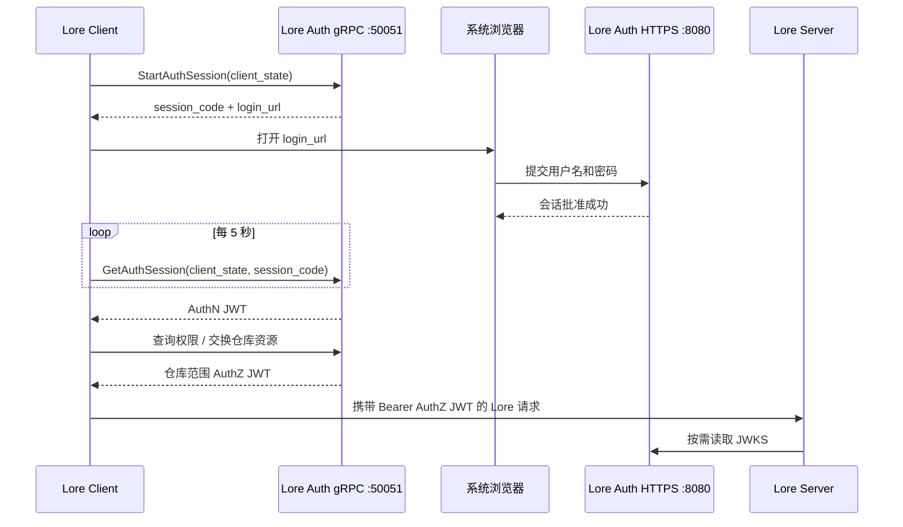

# Lore Auth Service

Lore Auth Service 是基于 TypeScript 与 Bun 实现的 [Epic Games Lore](https://github.com/EpicGames/lore) 原生浏览器认证及仓库授权服务。它提供 `ucs.auth.UrcAuthApi`、`ucs.auth.RebacApi` gRPC 服务，签发 Lore 兼容的 RS256 JWT，发布 JWKS，并附带轻量浏览器管理后台。

[English](README.md)

## 已实现能力

- Lore 原生浏览器登录：创建会话、打开登录页、轮询并取得 AuthN Token
- 含 Lore 必需 Claims 的 AuthN JWT 与仓库范围 AuthZ JWT
- 通过 `LookupUserPermissions` 浏览有权访问的仓库
- 通过 Lore ReBAC 创建和删除仓库资源
- 按用户配置仓库 `read`、`write`、`admin` 权限
- 使用 scrypt 哈希密码的本地账号
- 供 Lore Server 验签的 JWKS
- 面向管理后台和 API 客户端的 REST Access/Refresh Token
- 使用 SQLite 持久化用户、Refresh Token 哈希、浏览器会话哈希、资源和权限

## 认证流程



用户名和密码只会提交到认证服务的浏览器页面，不进入 Lore Client。JWT 不会写入浏览器 URL 或页面内容。

## 本地开发快速开始

前置条件：Bun 1.4 或更高版本。

```bash
bun install
cp .env.example .env
bun run start
```

第一次启动时，空数据库会创建配置中的管理员。开发默认账号为 `admin / changeme`；服务对外开放前必须修改 `ADMIN_PASSWORD`。

常用端点：

```bash
curl http://localhost:8080/health_check
curl http://localhost:8080/.well-known/jwks.json
```

打开 `http://localhost:8080/admin` 可管理用户、登记启用认证前已经存在的仓库，并分配仓库权限。

默认 gRPC 是明文端点，仅用于自动化测试和本地 API 开发。当前 Lore 客户端会把认证端点转换为 HTTPS，因此真实桌面登录必须使用下面的生产 TLS 配置。

## 跨平台可执行程序

项目使用 Bun Compile 生成不依赖目标机器预装 Bun 或 `node_modules` 的单文件程序。两个
gRPC Proto 通过 Bun embedded files 固化在程序内部，部署时不需要额外复制 `proto/`。

编译当前平台：

```bash
bun run build:compile
bun run test:compiled dist/windows-x64/lore-auth.exe
dist/windows-x64/lore-auth.exe -v
```

交叉编译全部支持目标：

```bash
bun run build:compile:all
```

也可以只编译一个目标，例如：

```bash
bun run build:compile --target=linux-x64
```

## 仓库 ID 命令行工具

仓库根目录中的 `.lore/id` 或 `.urc/id` 是 16 字节二进制 ID。以下命令会自动
识别仓库格式，并输出认证服务使用的 `urc-<32位十六进制>` 资源 ID：

```bash
bun run repository:id /path/to/repository
```

未传入仓库目录时默认检查当前目录。也可以直接指定 ID 文件：

```bash
bun run repository:id --id-file /path/to/repository/.lore/id
bun run repository:id --help
```

如果两种 ID 文件同时存在，工具会要求使用 `--id-file` 明确选择。命令行输出与
错误信息统一使用英文，出错时退出码为 `1`。

## 生产环境配置

准备 `auth.example.com` 一类 DNS 名称，以及 Lore Client 和 Lore Server 所在机器都信任的证书。服务可在 HTTP 与 gRPC 端口复用同一张证书。

环境变量示例：

```dotenv
HOST=0.0.0.0
PORT=8080
GRPC_HOST=0.0.0.0
GRPC_PORT=50051

PUBLIC_BASE_URL=https://auth.example.com:8080
JWT_ISSUER=https://auth.example.com:8080
JWT_AUDIENCE=lore.example.com
LORE_ENVIRONMENT=production

TLS_CERT_FILE=/run/secrets/lore-auth/fullchain.pem
TLS_KEY_FILE=/run/secrets/lore-auth/privkey.pem

ADMIN_USERNAME=admin
ADMIN_PASSWORD=替换为足够长的随机密码
```

关键点：

- `PUBLIC_BASE_URL` 是返回给浏览器的 `login_url` 所使用的 HTTPS Origin。
- Lore 认证端点是 `https://auth.example.com:50051`。
- `JWT_ISSUER` 必须与 Lore Server 的 `server.auth.jwt_issuer` 完全一致。
- `JWT_AUDIENCE` 是逗号分隔列表，必须包含 Lore Server 远端 URL 使用的真实主机名，例如 `lore.example.com`；不能再使用 `lore-service` 这类抽象名称。
- 证书必须覆盖认证端点主机名。如果使用内部 CA，需要把 CA 安装到每台 Lore Client 和 Lore Server 机器的信任库。

### Lore Server 配置

在 Lore Server 覆盖 TOML 中加入：

```toml
[environment.endpoint]
auth_url = "https://auth.example.com:50051"

[server.auth]
jwt_issuer = "https://auth.example.com:8080"
jwt_audience = ["lore.example.com"]

[server.auth.jwk]
endpoint = "https://auth.example.com:8080/.well-known/jwks.json"
```

修改后重启 Lore Server。服务端会向客户端发布 `environment.endpoint.auth_url`，校验 JWT 的签发者和受众，并从 JWKS 获取签名公钥。

### Lore Client

服务端重启后，在远端仓库弹窗点击刷新。若没有有效且已绑定的账号，Lore Client 应自动打开浏览器认证页。完成登录后返回客户端，再在账号管理器中把该账号绑定到相应仓库。

此前服务端日志里的 `MissingToken` 表示客户端已经连接到 Lore Server，但还没有携带已保存且已绑定的授权 Token。在浏览器认证尚未完成、认证地址缺失或账号未绑定时，这是预期现象。

## 从无认证 Lore Server 迁移

旧仓库的数据不需要重建或重新上传，但启用 JWT 认证前必须把每个现有仓库登记为认证资源，并给普通用户分配权限。迁移存在一个需要特别注意的引导依赖：

> Lore Server 配置 `auth_url` 后，`lore repository list` 也会先调用认证服务的 `LookupUserPermissions`，因此只能列出已经登记且当前用户有权访问的资源。直接在服务器上执行命令不会绕过认证，也无法发现尚未登记的旧仓库。

### 迁移前准备

- 备份 Lore Server 配置、存储数据，以及 Lore Auth Service 的 `DB_PATH`、`KEY_DIR`。
- 使用与 Lore Server 协议版本一致的 `lore` CLI。
- 安排短暂停机窗口。不得让两个 Lore Server 实例同时读写同一存储。
- 临时关闭认证进行仓库清点时，只允许监听回环地址，或通过防火墙限制为仅本机访问；不得把无认证的 `41337`、`41339` 暴露到局域网或公网。
- 记录迁移前的仓库名称、Repository ID、用户和预期权限，便于迁移后逐项核对。

### 第一步：清点旧仓库 ID

Repository ID 是 16 字节标识符的 32 位小写十六进制表示。管理后台使用的资源 ID 需要额外添加 `urc-` 前缀。

如果存在任意本地工作副本，请使用前述[仓库 ID 命令行工具](#仓库-id-命令行工具)。
工具会自动识别新格式 `.lore/id` 或旧格式 `.urc/id`，校验二进制 ID 是否正好为
16 字节，并输出带有 `urc-` 前缀的资源 ID：

```bash
bun run repository:id /path/to/repository
```

不需要手动选择 ID 文件、将其当作文本读取或再次计算哈希。非标准目录结构可使用
`bun run repository:id --id-file <path>` 显式指定 ID 文件。

如果以 Lore Server 的存储清单为准，并且认证还没有启用，可以直接在服务器或具有网络访问权限的同版本 CLI 上执行：

```bash
lore repository list lore://127.0.0.1:41337
```

输出格式为：

```text
repository-name (0194b726b34e72b0b45550b88a967076)
```

如果 Lore Server 已经配置了认证，则按以下顺序临时枚举完整清单：

1. 停止正式 Lore Server。
2. 备份配置，并临时移除或注释 `[environment.endpoint]` 中的 `auth_url`。
3. 保持原存储配置不变，仅在回环地址启动单个 Lore Server 实例。
4. 执行 `lore repository list lore://127.0.0.1:41337` 并保存完整输出。
5. 停止临时实例，在恢复正式认证配置前不要再次启动其他实例。

如果服务器容器没有打包 `lore` CLI，可以在宿主机使用相同版本的 CLI 访问临时回环端点，或者临时把 CLI 二进制只读挂载到容器；不要直接修改 Lore 存储数据库。

### 第二步：登记资源并分配权限

1. 启动 Lore Auth Service，确认 `DB_PATH` 和 `KEY_DIR` 位于持久化目录。
2. 检查 HTTP 健康端点和 JWKS：

   ```bash
   curl --fail --show-error https://auth.example.com:8080/health_check
   curl --fail --show-error https://auth.example.com:8080/.well-known/jwks.json
   ```

3. 登录 `https://auth.example.com:8080/admin`。
4. 为每个旧仓库登记 `urc-<32位Repository ID>`。仓库名称只用于管理界面显示，不参与 Lore 寻址。
5. 给每个普通用户分配所需权限：
   - `read`：浏览、Clone、读取仓库内容。
   - `write`：Push 和其他仓库写入操作；通常与 `read` 一起授予。
   - `admin`：仓库级管理操作，只授予需要管理资源的用户。

认证服务管理员对所有**已登记**资源隐式拥有三项权限，但仍无法访问未登记资源。迁移验证应至少使用一个普通用户，避免管理员的隐式权限掩盖漏配。

### 第三步：启用 JWT 验证

确认认证服务的公开值：

```dotenv
PUBLIC_BASE_URL=https://auth.example.com:8080
JWT_ISSUER=https://auth.example.com:8080
JWT_AUDIENCE=lore.example.com
LORE_ENVIRONMENT=production
```

然后恢复或加入 Lore Server 配置：

```toml
[environment.endpoint]
auth_url = "https://auth.example.com:50051"

[server.auth]
jwt_issuer = "https://auth.example.com:8080"
jwt_audience = ["lore.example.com"]

[server.auth.jwk]
endpoint = "https://auth.example.com:8080/.well-known/jwks.json"
```

必须满足：

- `JWT_ISSUER` 与 `jwt_issuer` 逐字一致，包括协议、主机名和端口。
- `JWT_AUDIENCE` 包含客户端实际使用的 Lore Server URL 主机名；如果客户端使用 IP 地址连接，就必须包含该 IP。
- Lore Server 能访问 Auth gRPC `50051` 和 JWKS HTTPS `8080`。
- gRPC TLS 证书覆盖 `auth_url` 主机名，反向代理保留 HTTP/2 gRPC 语义。
- `KEY_DIR` 在重启和重新部署后保持不变；删除它会轮换签名密钥，并使现有 JWT 失效。

### 第四步：重新登录并验收

1. 重启 Lore Server。
2. 在 Lore Client 或 CLI 中完成一次新的浏览器登录：

   ```bash
   lore auth login lores://lore.example.com:41337
   ```

3. 使用普通用户列出仓库：

   ```bash
   lore repository list lores://lore.example.com:41337
   ```

4. 确认输出只包含该用户获得权限的仓库，并核对名称和 Repository ID。
5. 在 Lore Client 中刷新服务器目录，把登录账号应用到目标仓库，再分别验证 Clone、读取和必要的 Push。
6. 检查 Lore Server 日志，确认登录后不再出现持续的 `MissingToken`、`authorization header required` 或 `Failed to connect to lore auth service`。

常见迁移故障：

| 现象 | 优先检查 |
|---|---|
| 登录成功但仓库列表为空 | 资源是否以 `urc-<32位ID>` 登记；普通用户是否至少有 `read` |
| `Failed to connect to lore auth service` | Lore Server 到 Auth gRPC `50051` 的 DNS、IPv4/IPv6、TLS、SNI 和 HTTP/2 |
| `MissingToken` / `authorization header required` | 客户端是否完成浏览器登录；账号是否应用到当前服务器或仓库 |
| JWT issuer 校验失败 | `JWT_ISSUER` 与 `server.auth.jwt_issuer` 是否逐字一致 |
| JWT audience 校验失败 | `JWT_AUDIENCE` 是否包含 Lore URL 实际使用的主机名或 IP |
| JWKS 获取失败或未知 `kid` | Lore Server 是否能访问 `/.well-known/jwks.json`；`KEY_DIR` 是否被意外更换 |

若必须回滚，停止 Lore Server，恢复迁移前的无认证配置后再启动。认证服务中新增的资源和权限不会修改 Lore 仓库数据，可以保留供下一次迁移继续使用。

## Docker

仓库中的 compose 默认启动本地开发实例：

```bash
docker compose up -d --build
docker compose logs -f lore-auth
```

它会暴露 HTTP `8080` 与 gRPC `50051`，并持久化 `/app/keys` 和 `/app/data`。

### Lore Server + Lore Auth 一键联动预设

项目另提供 `docker-compose.lore-stack.yml`，可同时启动 Lore Server、Lore Auth 和一次性配置初始化容器。该预设会从同一个 `LORE_EXTERNAL_HOST` 推导证书 SAN、浏览器地址、JWT issuer/audience、Auth gRPC 地址和 Lore Server JWKS 配置，适合 `192.168.1.2` 一类内网 IP 部署。

```bash
cp .env.lore-stack.example .env.lore-stack
# 编辑 LORE_EXTERNAL_HOST、ADMIN_PASSWORD 等值
docker compose --env-file .env.lore-stack -f docker-compose.lore-stack.yml up -d --build
```

默认 `LORE_TLS_MODE=auto`：初始化容器会创建持久化本地 CA，并签发覆盖外部 IP、`lore-auth`、`lore-server`、`localhost` 的证书。证书保存在 Docker 命名卷中，普通重启不会轮换。Lore Server 默认拉取 `ghcr.io/arnochenfx/lore-server:latest`，该镜像由仓库中的手动 GitHub Actions 工作流从 Epic Games 官方源码构建。工作流另会每日自动发布 `nightly`（上游 `main` 最新提交）、`stable`（最新正式版，如 `v0.8.6`）及同步版本标签 `v0.8.6` / `0.8.6` / `0.8` / `0` 与不可变 `sha-<short>` 标签。

启动后常用地址（以 `192.168.1.2` 为例）：

- Lore Server（TLS 加密）：`lores://192.168.1.2:41337`
  > **注意**：`lore://` 使用明文 gRPC，`lores://` 使用 TLS 加密 gRPC。lore-stack 部署默认启用 TLS，因此必须使用 `lores://` scheme。
- Lore Auth 管理后台：`https://192.168.1.2:8080/admin`
- Lore Auth gRPC：`https://192.168.1.2:50051`
- Lore Server 健康检查：`http://192.168.1.2:41339/health_check`

自动生成的 CA 不是公网受信 CA。Lore Server 容器会自动信任它，但每台 Lore Client 所在机器仍须由管理员把 CA 加入系统信任库。可从命名卷导出 CA：

```bash
docker compose --env-file .env.lore-stack -f docker-compose.lore-stack.yml \
  cp lore-stack-init:/output/ca.pem ./lore-stack-ca.pem
```

然后按操作系统的受信任根证书流程安装 `lore-stack-ca.pem`，重启 Lore Client。Compose 不会自动修改宿主机信任库，因为该操作需要管理员权限。若 `LORE_EXTERNAL_HOST` 改变，初始化容器会重新创建 CA 和服务器证书，客户端也需要重新安装新的 CA。

使用已有证书时，将证书链、私钥和签发 CA 放入 `LORE_TLS_SOURCE_DIR`，并设置：

```dotenv
LORE_TLS_MODE=custom
LORE_TLS_SOURCE_DIR=./deploy/lore-stack/certs
LORE_TLS_CERT_FILE=fullchain.pem
LORE_TLS_KEY_FILE=privkey.pem
LORE_TLS_CA_FILE=ca.pem
```

初始化阶段会校验证书与私钥是否匹配，以及证书是否覆盖 `LORE_EXTERNAL_HOST`。自定义证书目录已被 Git 忽略，切勿提交私钥。

#### Lore Server 自定义覆盖配置

初始化容器将自动联动配置写入 `stack.toml`，不会再覆盖用户的 `local.toml`。需要增加 Telemetry 或其他 Lore Server 参数时：

```bash
cp deploy/lore-stack/config/local.toml.example deploy/lore-stack/config/local.toml
```

例如：

```toml
[telemetry.logger]
format = "text"
output = "stdout"
enable_otlp = false

[server.http]
store_health_check = true
```

然后重新运行初始化容器并重启 Lore Server：

```bash
docker compose --env-file .env.lore-stack -f docker-compose.lore-stack.yml \
  run --rm lore-stack-init
docker compose --env-file .env.lore-stack -f docker-compose.lore-stack.yml \
  up -d --force-recreate lore-server
```

Compose 将 `LORE_SERVER_CONFIG_DIR` 直接挂载给初始化容器和 Lore Server。初始化器只创建或覆盖该目录中的 `stack.toml`，不会读取、复制、修改或删除 `local.toml`。Lore 按 `stack.toml`、`local.toml` 的顺序加载配置，因此 `local.toml` 中的同名字段优先级更高。不要覆盖认证地址、JWT、JWKS、存储路径及 QUIC/gRPC 证书表，否则可能破坏自动联动。

生产环境需要只读挂载证书并覆盖公网配置：

```yaml
services:
  lore-auth:
    ports:
      - "8080:8080"
      - "50051:50051"
    environment:
      PUBLIC_BASE_URL: "https://auth.example.com:8080"
      JWT_ISSUER: "https://auth.example.com:8080"
      JWT_AUDIENCE: "lore.example.com"
      LORE_ENVIRONMENT: "production"
      TLS_CERT_FILE: "/app/certs/fullchain.pem"
      TLS_KEY_FILE: "/app/certs/privkey.pem"
      ADMIN_PASSWORD: "替换为足够长的随机密码"
    volumes:
      - ./certs:/app/certs:ro
```

也可以由反向代理终止 HTTPS 与 gRPC TLS，但公开的 gRPC 路由必须保留 HTTP/2 gRPC 语义，普通 HTTP/1 代理无法工作。

## 管理与仓库权限


管理后台位于 `/admin`。管理员登录卡片在页面中居中显示，进入控制台后自动恢复紧凑的管理布局。仓库、用户、权限选项与保存按钮在桌面端显示于同一配置行。管理页面和浏览器认证页默认显示英文，用户可在页面顶部切换中文；语言选择通过 `localStorage` 记住。管理页面还提供亮色与暗色模式，暗色模式使用中性暗灰背景，并在首次访问时跟随系统主题。Access Token 与 Refresh Token 只保存在当前标签页的 `sessionStorage` 中，关闭标签页或退出登录后会被清除。

通过 Lore ReBAC 创建的新仓库会自动登记，创建者取得 `read`、`write` 和 `admin`。对启用认证前已经存在的仓库：

1. 找到 32 位十六进制 Lore Repository ID。
2. 在管理后台登记 `urc-<repository-id>`。
3. 为每个用户分配所需权限。

完整的停机清点、JWT 配置、权限迁移和验收步骤见“从无认证 Lore Server 迁移”。

管理员隐式拥有所有已登记仓库的权限；普通用户只能看到并交换显式授权仓库的 Token。

## HTTP API

| 方法 | 路径 | 认证 | 作用 |
|---|---|---|---|
| `GET` | `/.well-known/jwks.json` | 无 | 供 Lore Server 使用的 RS256 公钥 |
| `GET` | `/health_check` | 无 | HTTP 服务健康检查 |
| `GET` | `/login` | 会话查询参数 | Lore 浏览器认证页 |
| `POST` | `/auth/session/approve` | 会话表单 | 批准 Lore 浏览器会话 |
| `POST` | `/auth/login` | 无 | REST 用户名密码登录 |
| `POST` | `/auth/refresh` | Refresh Token | 轮换 REST Refresh Token |
| `GET` | `/auth/me` | Bearer | 校验并查看 JWT |
| `GET` | `/admin` | 无 | 管理后台 |
| `GET/POST` | `/admin/users` | 管理员 Bearer | 列出或创建用户 |
| `DELETE` | `/admin/users/:username` | 管理员 Bearer | 删除用户 |
| `GET/POST` | `/admin/resources` | 管理员 Bearer | 列出或登记仓库 |
| `PUT` | `/admin/resources/:id/users/:username` | 管理员 Bearer | 覆盖仓库权限 |

## gRPC API

两个服务使用 `proto/` 中的定义：

- `ucs.auth.UrcAuthApi`：浏览器会话、Token 交换、权限查询和用户查询
- `ucs.auth.RebacApi`：Lore 仓库资源创建与删除

`RefreshAuthSession` 和 API Key 交换当前返回 `UNIMPLEMENTED`。本项目固定的 Lore 客户端不会在浏览器登录中发送 Refresh Token；AuthN Token 过期后需要重新认证。管理 API 使用的 REST Refresh Token 轮换不受影响。

## 配置参数

| 变量 | 默认值 | 说明 |
|---|---:|---|
| `HOST` | `0.0.0.0` | HTTP 绑定地址 |
| `PORT` | `8080` | HTTP/HTTPS 端口 |
| `GRPC_HOST` | `0.0.0.0` | gRPC 绑定地址 |
| `GRPC_PORT` | `50051` | gRPC Auth/ReBAC 端口 |
| `PUBLIC_BASE_URL` | `JWT_ISSUER` | 浏览器可访问的登录 Origin |
| `JWT_ISSUER` | `http://localhost:8080` | JWT `iss` |
| `JWT_AUDIENCE` | `localhost` | 逗号分隔的 JWT 受众 |
| `LORE_ENVIRONMENT` | `local` | JWT `env` Claim |
| `TOKEN_TTL` | `864000` | JWT 有效期（秒，默认 10 天） |
| `REFRESH_TOKEN_TTL` | `604800` | REST Refresh Token 有效期 |
| `AUTH_SESSION_TTL` | `300` | 浏览器会话有效期 |
| `AUTH_SESSION_MAX_ATTEMPTS` | `5` | 临时锁定前的失败次数 |
| `AUTH_SESSION_LOCK_SECONDS` | `60` | 临时锁定时长 |
| `KEY_DIR` | `./keys` | 持久化 RS256 密钥目录 |
| `DB_PATH` | `./lore-auth.db` | SQLite 数据库 |
| `ADMIN_USERNAME` | `admin` | 初始管理员 |
| `ADMIN_PASSWORD` | `changeme` | 初始管理员密码 |
| `TLS_CERT_FILE` | 未配置 | HTTP 与 gRPC 使用的 PEM 证书链 |
| `TLS_KEY_FILE` | 未配置 | HTTP 与 gRPC 使用的 PEM 私钥 |

## 验证

```bash
bun run typecheck
bun test
```

集成测试会启动真实 gRPC Server，并验证：

- 浏览器会话创建与批准
- AuthN JWT 及 Lore 必需 Claims
- 权限查询
- 仓库范围 AuthZ 交换
- 无效浏览器会话拒绝
- 会话哈希持久化与创建者权限

## 安全说明

- 密码使用带盐 scrypt；用户名不存在时也执行等价哈希计算。
- 浏览器会话秘密值与 Refresh Token 只保存 SHA-256 哈希。
- 浏览器会话短期有效，并同时绑定 `client_state` 与 `session_code`。
- 登录失败按浏览器会话进行次数限制和临时锁定。
- JWT 与密码不会写入应用日志、浏览器 URL 或浏览器登录 HTML。
- 浏览器页与管理页设置严格 CSP、防嵌入、禁止缓存和禁止 Referrer 响应头。
- 删除 `KEY_DIR` 会轮换签名密钥，并使全部已签发 JWT 失效。

## 开源协议

MIT。
