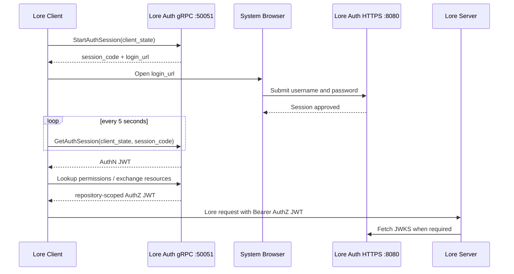

# Lore Auth Service

Lore Auth Service is a TypeScript/Bun implementation of Lore's native browser authentication and repository authorization protocols. It exposes the `ucs.auth.UrcAuthApi` and `ucs.auth.RebacApi` gRPC services, issues Lore-compatible RS256 JWTs, publishes JWKS, and provides a small browser administration panel.

[Chinese documentation](README-zh.md)

## What is implemented

- Native Lore browser login: start session, open login page, poll, and receive an AuthN token
- AuthN and repository-scoped AuthZ JWTs with all claims required by Lore
- Repository discovery through `LookupUserPermissions`
- Resource creation/deletion through Lore ReBAC
- Per-user `read`, `write`, and `admin` repository permissions
- Username/password users with scrypt password hashing
- JWKS verification for Lore Server
- REST access/refresh tokens for the administration panel and API clients
- SQLite persistence for users, hashed refresh tokens, hashed browser sessions, resources, and permissions

## Authentication flow



The username and password are submitted only to the auth service's browser page. They do not enter Lore Client, and JWTs are never placed in browser URLs or page content.

## Quick start for local development

Prerequisite: Bun 1.3 or newer.

```bash
bun install
cp .env.example .env
bun run start
```

On the first start, an empty database receives the configured administrator. The development defaults are `admin / changeme`; change `ADMIN_PASSWORD` before exposing the service.

Useful endpoints:

```bash
curl http://localhost:8080/health_check
curl http://localhost:8080/.well-known/jwks.json
```

Open `http://localhost:8080/admin` to manage users, register repositories created before authentication was enabled, and assign repository access. The administration and browser authentication pages use English by default and can be switched to Chinese. The administration page also supports light and dark themes. Language and theme preferences are saved in the current browser.

The default gRPC endpoint is insecure and intended only for automated tests and local API development. The current Lore client converts its auth endpoint to HTTPS, so a real desktop login requires the production TLS setup below.

## Cross-platform executables

The project uses Bun Compile to produce standalone executables that do not require Bun,
Node.js, or `node_modules` on the target machine. Both gRPC Proto files are embedded in
the executable through Bun embedded files, so the `proto/` directory does not need to be
copied during deployment.

Compile for the current platform:

```bash
bun run build:compile
bun run test:compiled dist/windows-x64/lore-auth.exe
dist/windows-x64/lore-auth.exe -v
```

Cross-compile every supported target:

```bash
bun run build:compile:all
```

Compile one explicit target:

```bash
bun run build:compile --target=linux-x64
```

## Repository ID command-line tool

The `.lore/id` or `.urc/id` file under a repository root contains a 16-byte
binary ID. The following command detects the repository format automatically
and prints the `urc-<32-lowercase-hex>` resource ID used by the auth service:

```bash
bun run repository:id /path/to/repository
```

When no repository directory is provided, the tool checks the current working
directory. You can also specify the ID file explicitly:

```bash
bun run repository:id --id-file /path/to/repository/.lore/id
bun run repository:id --help
```

If both ID files exist, the tool requires `--id-file` to select one explicitly.
All command output and error messages are in English. Errors return exit code
`1`.

## Production setup

Use a DNS name such as `auth.example.com` and a certificate trusted by the machines running Lore Client and Lore Server. The same certificate can be used by this service on its HTTP and gRPC ports.

Example environment:

```dotenv
HOST=0.0.0.0
PORT=8080
GRPC_HOST=0.0.0.0
GRPC_PORT=50051

PUBLIC_BASE_URL=https://auth.example.com:8080
JWT_ISSUER=https://auth.example.com:8080
JWT_AUDIENCE=lore.example.com
LORE_ENVIRONMENT=production

TLS_CERT_FILE=/run/secrets/lore-auth/fullchain.pem
TLS_KEY_FILE=/run/secrets/lore-auth/privkey.pem

ADMIN_USERNAME=admin
ADMIN_PASSWORD=replace-with-a-long-random-password
```

Important:

- `PUBLIC_BASE_URL` is the browser-visible HTTPS origin used in `login_url`.
- The Lore auth endpoint is `https://auth.example.com:50051`.
- `JWT_ISSUER` must exactly match Lore Server's `server.auth.jwt_issuer`.
- `JWT_AUDIENCE` is a comma-separated list and must contain the actual hostname used by the Lore Server remote URL, for example `lore.example.com`. Do not use an abstract value such as `lore-service`.
- The certificate must cover the auth endpoint hostname. For an internal CA, install that CA in the trust store of every Lore Client and Lore Server machine.

### Lore Server configuration

Add these values to the Lore Server override TOML:

```toml
[environment.endpoint]
auth_url = "https://auth.example.com:50051"

[server.auth]
jwt_issuer = "https://auth.example.com:8080"
jwt_audience = ["lore.example.com"]

[server.auth.jwk]
endpoint = "https://auth.example.com:8080/.well-known/jwks.json"
```

Restart Lore Server after changing authentication settings. The server advertises `environment.endpoint.auth_url` to Lore clients, verifies JWT issuer/audience, and fetches signing keys from JWKS.

### Lore Client

Refresh the remote repository dialog after the server restarts. When no valid account is bound, Lore Client should launch the browser login automatically. Sign in on the Lore Auth page, return to the client, then bind the resulting account to the relevant repositories in the client's account manager.

The previous `MissingToken` server log means the client reached Lore Server without a stored/bound authorization token. It is expected before the browser flow completes or when the auth URL/account binding is missing.

## Migrating an unauthenticated Lore Server

Existing repository data does not need to be rebuilt or uploaded again. Before JWT authentication is enabled, however, every existing repository must be registered as an auth resource and ordinary users must receive explicit permissions. The migration has an important bootstrap dependency:

> After Lore Server is configured with `auth_url`, `lore repository list` also calls the auth service's `LookupUserPermissions` first. It can therefore return only resources that are already registered and visible to the current user. Running the command on the server does not bypass authentication and cannot discover an unregistered legacy repository.

### Preparation

- Back up the Lore Server configuration and storage, plus Lore Auth Service's `DB_PATH` and `KEY_DIR`.
- Use a `lore` CLI build that matches the Lore Server protocol version.
- Schedule a short maintenance window. Never run two Lore Server processes against the same storage.
- While authentication is temporarily disabled for discovery, bind only to loopback or restrict access to the local machine with a firewall. Never expose unauthenticated ports `41337` or `41339` to a LAN or the Internet.
- Record the repository names, Repository IDs, users, and intended permissions before the change so that they can be checked after migration.

### Step 1: Inventory legacy Repository IDs

A Repository ID is the 32-lowercase-hex representation of a 16-byte identifier. The administration panel uses the same value with an additional `urc-` prefix.

If any local working copy exists, use the
[Repository ID command-line tool](#repository-id-command-line-tool). It detects
the current `.lore/id` or legacy `.urc/id` format automatically, verifies that
the binary ID is exactly 16 bytes, and prints the resource ID with its `urc-`
prefix:

```bash
bun run repository:id /path/to/repository
```

There is no need to select the ID file manually, read it as text, or hash it
again. For a non-standard directory layout, use
`bun run repository:id --id-file <path>` to select the ID file explicitly.

To use the Lore Server's authoritative storage inventory before authentication has been enabled, run this on the server or from a matching CLI with network access:

```bash
lore repository list lore://127.0.0.1:41337
```

The output format is:

```text
repository-name (0194b726b34e72b0b45550b88a967076)
```

If Lore Server already has authentication configured, enumerate the complete inventory in this order:

1. Stop the production Lore Server.
2. Back up the configuration and temporarily remove or comment out `auth_url` under `[environment.endpoint]`.
3. Keep the original storage configuration and start exactly one Lore Server instance bound only to loopback.
4. Run `lore repository list lore://127.0.0.1:41337` and save the complete output.
5. Stop the temporary instance. Do not start any other instance before restoring the production authentication configuration.

If the server container does not include the `lore` CLI, use a matching CLI on the host to access the temporary loopback endpoint, or mount the CLI binary read-only into the container. Do not edit the Lore storage database directly.

### Step 2: Register resources and assign permissions

1. Start Lore Auth Service and confirm that `DB_PATH` and `KEY_DIR` use persistent storage.
2. Check the HTTP health endpoint and JWKS:

   ```bash
   curl --fail --show-error https://auth.example.com:8080/health_check
   curl --fail --show-error https://auth.example.com:8080/.well-known/jwks.json
   ```

3. Sign in to `https://auth.example.com:8080/admin`.
4. Register `urc-<32-hex-character Repository ID>` for each legacy repository. The repository name is display-only and does not participate in Lore addressing.
5. Assign each ordinary user the required permissions:
   - `read`: browse, clone, and read repository content.
   - `write`: push and other repository writes; normally grant it together with `read`.
   - `admin`: repository-level administration; grant it only to users who manage the resource.

Auth service administrators implicitly receive all three permissions for every **registered** resource, but they still cannot access an unregistered resource. Validate the migration with at least one ordinary user so that administrator privileges do not hide missing assignments.

### Step 3: Enable JWT verification

Confirm the auth service's public values:

```dotenv
PUBLIC_BASE_URL=https://auth.example.com:8080
JWT_ISSUER=https://auth.example.com:8080
JWT_AUDIENCE=lore.example.com
LORE_ENVIRONMENT=production
```

Then restore or add the Lore Server configuration:

```toml
[environment.endpoint]
auth_url = "https://auth.example.com:50051"

[server.auth]
jwt_issuer = "https://auth.example.com:8080"
jwt_audience = ["lore.example.com"]

[server.auth.jwk]
endpoint = "https://auth.example.com:8080/.well-known/jwks.json"
```

The following invariants must hold:

- `JWT_ISSUER` and `jwt_issuer` must match byte-for-byte, including scheme, hostname, and port.
- `JWT_AUDIENCE` must contain the hostname actually used in the Lore Server URL. If clients connect by IP address, include that IP address.
- Lore Server must be able to reach Auth gRPC on `50051` and JWKS HTTPS on `8080`.
- The gRPC TLS certificate must cover the `auth_url` hostname, and a reverse proxy must preserve HTTP/2 gRPC semantics.
- `KEY_DIR` must remain stable across restarts and deployments. Removing it rotates the signing key and invalidates issued JWTs.

### Step 4: Sign in again and validate

1. Restart Lore Server.
2. Complete a fresh browser login from Lore Client or the CLI:

   ```bash
   lore auth login lore://lore.example.com:41337
   ```

3. List repositories as an ordinary user:

   ```bash
   lore repository list lore://lore.example.com:41337
   ```

4. Confirm that the output contains only repositories granted to that user, with the expected names and Repository IDs.
5. Refresh the server directory in Lore Client, apply the signed-in account to the target repositories, then verify clone, read, and any required push operations.
6. Inspect Lore Server logs and confirm that persistent `MissingToken`, `authorization header required`, or `Failed to connect to lore auth service` errors no longer appear after login.

Common migration failures:

| Symptom | Check first |
|---|---|
| Login succeeds but the repository list is empty | The resource is registered as `urc-<32-hex-ID>` and the ordinary user has at least `read` |
| `Failed to connect to lore auth service` | DNS, IPv4/IPv6, TLS, SNI, and HTTP/2 from Lore Server to Auth gRPC `50051` |
| `MissingToken` / `authorization header required` | Browser login completed and the account is applied to the current server or repository |
| JWT issuer validation fails | `JWT_ISSUER` exactly matches `server.auth.jwt_issuer` |
| JWT audience validation fails | `JWT_AUDIENCE` contains the hostname or IP actually used by the Lore URL |
| JWKS fetch fails or `kid` is unknown | Lore Server can access `/.well-known/jwks.json` and `KEY_DIR` was not replaced |

To roll back, stop Lore Server, restore the previous unauthenticated configuration, and start it again. Resources and permissions added to the auth service do not modify Lore repository data and may remain in place for the next migration attempt.

## Docker

The checked-in compose file starts a local development instance:

```bash
docker compose up -d --build
docker compose logs -f lore-auth
```

It exposes HTTP on `8080` and gRPC on `50051`, and persists `/app/keys` and `/app/data`.

For production, mount certificates read-only and override the public values:

```yaml
services:
  lore-auth:
    ports:
      - "8080:8080"
      - "50051:50051"
    environment:
      PUBLIC_BASE_URL: "https://auth.example.com:8080"
      JWT_ISSUER: "https://auth.example.com:8080"
      JWT_AUDIENCE: "lore.example.com"
      LORE_ENVIRONMENT: "production"
      TLS_CERT_FILE: "/app/certs/fullchain.pem"
      TLS_KEY_FILE: "/app/certs/privkey.pem"
      ADMIN_PASSWORD: "replace-with-a-long-random-password"
    volumes:
      - ./certs:/app/certs:ro
```

Alternatively, terminate HTTPS and gRPC TLS at a reverse proxy. The public gRPC route must preserve HTTP/2 gRPC semantics; a normal HTTP/1 proxy is not sufficient.

## Administration

The administration panel is available at `/admin`. The administrator sign-in card is centered on the page, and a compact administration layout is restored after sign-in. The repository, user, permission controls, and save button share one configuration row on desktop screens. The administration and browser authentication pages display English by default and provide a language switch at the top of the page; the selected language is saved in `localStorage`. The administration page also supports light and dark themes, uses neutral dark-gray backgrounds in dark mode, and follows the system theme on the first visit. Access and refresh tokens live only in the current tab's `sessionStorage` and are removed when the tab closes or the operator signs out.

New repositories created through Lore ReBAC are registered automatically and their creator receives `read`, `write`, and `admin`. For repositories that existed before auth was enabled:

1. Find the 32-hex-character Lore Repository ID.
2. Register `urc-<repository-id>` in the administration panel.
3. Assign the required permissions to each user.

See “Migrating an unauthenticated Lore Server” for the complete downtime inventory, JWT configuration, permission migration, and validation procedure.

Administrators have implicit access to all registered repositories. Ordinary users only see and exchange tokens for explicitly assigned repositories.

## HTTP API

| Method | Path | Authentication | Purpose |
|---|---|---|---|
| `GET` | `/.well-known/jwks.json` | none | RS256 public keys for Lore Server |
| `GET` | `/health_check` | none | HTTP service health |
| `GET` | `/login` | session query | Lore browser session page |
| `POST` | `/auth/session/approve` | session form | Approve a Lore browser session |
| `POST` | `/auth/login` | none | REST username/password login |
| `POST` | `/auth/refresh` | refresh token | Rotate a REST refresh token |
| `GET` | `/auth/me` | Bearer | Validate and inspect a JWT |
| `GET` | `/admin` | none | Administration panel |
| `GET/POST` | `/admin/users` | admin Bearer | List/create users |
| `DELETE` | `/admin/users/:username` | admin Bearer | Delete a user |
| `GET/POST` | `/admin/resources` | admin Bearer | List/register repositories |
| `PUT` | `/admin/resources/:id/users/:username` | admin Bearer | Replace repository permissions |

## gRPC API

Both services use the definitions in `proto/`:

- `ucs.auth.UrcAuthApi`: browser sessions, token exchange, permission lookup, and user lookup
- `ucs.auth.RebacApi`: Lore repository resource creation and deletion

`RefreshAuthSession` and API-key exchange return `UNIMPLEMENTED`. The fixed Lore client used by this project does not send refresh tokens during browser login; users authenticate again after the AuthN token expires. REST refresh-token rotation remains supported for the administration API.

## Configuration

| Variable | Default | Description |
|---|---:|---|
| `HOST` | `0.0.0.0` | HTTP bind address |
| `PORT` | `8080` | HTTP/HTTPS port |
| `GRPC_HOST` | `0.0.0.0` | gRPC bind address |
| `GRPC_PORT` | `50051` | gRPC Auth/ReBAC port |
| `PUBLIC_BASE_URL` | `JWT_ISSUER` | Browser-visible login origin |
| `JWT_ISSUER` | `http://localhost:8080` | JWT `iss` |
| `JWT_AUDIENCE` | `localhost` | Comma-separated JWT audiences |
| `LORE_ENVIRONMENT` | `local` | JWT `env` claim |
| `TOKEN_TTL` | `43200` | JWT lifetime in seconds |
| `REFRESH_TOKEN_TTL` | `604800` | REST refresh-token lifetime |
| `AUTH_SESSION_TTL` | `300` | Browser session lifetime |
| `AUTH_SESSION_MAX_ATTEMPTS` | `5` | Failed logins before a temporary lock |
| `AUTH_SESSION_LOCK_SECONDS` | `60` | Temporary lock duration |
| `KEY_DIR` | `./keys` | persisted RS256 key directory |
| `DB_PATH` | `./lore-auth.db` | SQLite database |
| `ADMIN_USERNAME` | `admin` | bootstrap administrator |
| `ADMIN_PASSWORD` | `changeme` | bootstrap password |
| `TLS_CERT_FILE` | unset | PEM certificate chain for HTTP and gRPC |
| `TLS_KEY_FILE` | unset | PEM private key for HTTP and gRPC |

## Verification

```bash
bun run typecheck
bun test
```

The integration suite starts a real gRPC server and verifies:

- browser session creation and approval
- AuthN JWT issuance and required Lore claims
- permission lookup
- repository-scoped AuthZ exchange
- invalid browser-session rejection
- hashed session persistence and creator permissions

## Security

- Passwords use salted scrypt hashes; unknown users perform an equivalent hash operation.
- Browser session secrets and refresh tokens are stored only as SHA-256 hashes.
- Browser session URLs are short-lived and bound to both `client_state` and `session_code`.
- Login attempts are rate-limited per browser session.
- JWTs and passwords are not written to application logs, browser URLs, or browser login HTML.
- Browser and administration pages set restrictive CSP, anti-framing, no-cache, and no-referrer headers.
- Removing `KEY_DIR` rotates the signing key and invalidates all issued JWTs.

## License

MIT.
