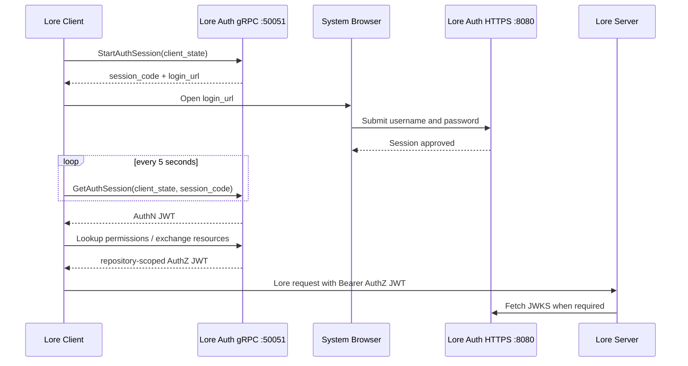

# Lore Auth Service

Lore Auth Service is a TypeScript/Bun implementation of Lore's native browser authentication and repository authorization protocols. It exposes the `ucs.auth.UrcAuthApi` and `ucs.auth.RebacApi` gRPC services, issues Lore-compatible RS256 JWTs, publishes JWKS, and provides a small browser administration panel.

[中文文档](README-zh.md) · [Integration guide](AUTH_INTEGRATION.md)

## What is implemented

- Native Lore browser login: start session, open login page, poll, and receive an AuthN token
- AuthN and repository-scoped AuthZ JWTs with all claims required by Lore
- Repository discovery through `LookupUserPermissions`
- Resource creation/deletion through Lore ReBAC
- Per-user `read`, `write`, and `admin` repository permissions
- Username/password users with scrypt password hashing
- JWKS verification for Lore Server
- REST access/refresh tokens for the administration panel and API clients
- SQLite persistence for users, hashed refresh tokens, hashed browser sessions, resources, and permissions

## Authentication flow



The username and password are submitted only to the auth service's browser page. They do not enter Lore Client, and JWTs are never placed in browser URLs or page content.

## Quick start for local development

Prerequisite: Bun 1.3 or newer.

```bash
bun install
cp .env.example .env
bun run start
```

On the first start, an empty database receives the configured administrator. The development defaults are `admin / changeme`; change `ADMIN_PASSWORD` before exposing the service.

Useful endpoints:

```bash
curl http://localhost:8080/health_check
curl http://localhost:8080/.well-known/jwks.json
```

Open `http://localhost:8080/admin` to manage users, register repositories created before authentication was enabled, and assign repository access.

The default gRPC endpoint is insecure and intended only for automated tests and local API development. The current Lore client converts its auth endpoint to HTTPS, so a real desktop login requires the production TLS setup below.

## Production setup

Use a DNS name such as `auth.example.com` and a certificate trusted by the machines running Lore Client and Lore Server. The same certificate can be used by this service on its HTTP and gRPC ports.

Example environment:

```dotenv
HOST=0.0.0.0
PORT=8080
GRPC_HOST=0.0.0.0
GRPC_PORT=50051

PUBLIC_BASE_URL=https://auth.example.com:8080
JWT_ISSUER=https://auth.example.com:8080
JWT_AUDIENCE=lore.example.com
LORE_ENVIRONMENT=production

TLS_CERT_FILE=/run/secrets/lore-auth/fullchain.pem
TLS_KEY_FILE=/run/secrets/lore-auth/privkey.pem

ADMIN_USERNAME=admin
ADMIN_PASSWORD=replace-with-a-long-random-password
```

Important:

- `PUBLIC_BASE_URL` is the browser-visible HTTPS origin used in `login_url`.
- The Lore auth endpoint is `https://auth.example.com:50051`.
- `JWT_ISSUER` must exactly match Lore Server's `server.auth.jwt_issuer`.
- `JWT_AUDIENCE` is a comma-separated list and must contain the actual hostname used by the Lore Server remote URL, for example `lore.example.com`. Do not use an abstract value such as `lore-service`.
- The certificate must cover the auth endpoint hostname. For an internal CA, install that CA in the trust store of every Lore Client and Lore Server machine.

### Lore Server configuration

Add these values to the Lore Server override TOML:

```toml
[environment.endpoint]
auth_url = "https://auth.example.com:50051"

[server.auth]
jwt_issuer = "https://auth.example.com:8080"
jwt_audience = ["lore.example.com"]

[server.auth.jwk]
endpoint = "https://auth.example.com:8080/.well-known/jwks.json"
```

Restart Lore Server after changing authentication settings. The server advertises `environment.endpoint.auth_url` to Lore clients, verifies JWT issuer/audience, and fetches signing keys from JWKS.

### Lore Client

Refresh the remote repository dialog after the server restarts. When no valid account is bound, Lore Client should launch the browser login automatically. Sign in on the Lore Auth page, return to the client, then bind the resulting account to the relevant repositories in the client's account manager.

The previous `MissingToken` server log means the client reached Lore Server without a stored/bound authorization token. It is expected before the browser flow completes or when the auth URL/account binding is missing.

## Docker

The checked-in compose file starts a local development instance:

```bash
docker compose up -d --build
docker compose logs -f lore-auth
```

It exposes HTTP on `8080` and gRPC on `50051`, and persists `/app/keys` and `/app/data`.

For production, mount certificates read-only and override the public values:

```yaml
services:
  lore-auth:
    ports:
      - "8080:8080"
      - "50051:50051"
    environment:
      PUBLIC_BASE_URL: "https://auth.example.com:8080"
      JWT_ISSUER: "https://auth.example.com:8080"
      JWT_AUDIENCE: "lore.example.com"
      LORE_ENVIRONMENT: "production"
      TLS_CERT_FILE: "/app/certs/fullchain.pem"
      TLS_KEY_FILE: "/app/certs/privkey.pem"
      ADMIN_PASSWORD: "replace-with-a-long-random-password"
    volumes:
      - ./certs:/app/certs:ro
```

Alternatively, terminate HTTPS and gRPC TLS at a reverse proxy. The public gRPC route must preserve HTTP/2 gRPC semantics; a normal HTTP/1 proxy is not sufficient.

## Administration

The administration panel is available at `/admin`. Its access and refresh tokens live only in the current tab's `sessionStorage` and are removed when the tab closes or the operator signs out.

New repositories created through Lore ReBAC are registered automatically and their creator receives `read`, `write`, and `admin`. For repositories that existed before auth was enabled:

1. Find the 32-hex-character Lore Repository ID.
2. Register `urc-<repository-id>` in the administration panel.
3. Assign the required permissions to each user.

Administrators have implicit access to all registered repositories. Ordinary users only see and exchange tokens for explicitly assigned repositories.

## HTTP API

| Method | Path | Authentication | Purpose |
|---|---|---|---|
| `GET` | `/.well-known/jwks.json` | none | RS256 public keys for Lore Server |
| `GET` | `/health_check` | none | HTTP service health |
| `GET` | `/login` | session query | Lore browser session page |
| `POST` | `/auth/session/approve` | session form | Approve a Lore browser session |
| `POST` | `/auth/login` | none | REST username/password login |
| `POST` | `/auth/refresh` | refresh token | Rotate a REST refresh token |
| `GET` | `/auth/me` | Bearer | Validate and inspect a JWT |
| `GET` | `/admin` | none | Administration panel |
| `GET/POST` | `/admin/users` | admin Bearer | List/create users |
| `DELETE` | `/admin/users/:username` | admin Bearer | Delete a user |
| `GET/POST` | `/admin/resources` | admin Bearer | List/register repositories |
| `PUT` | `/admin/resources/:id/users/:username` | admin Bearer | Replace repository permissions |

## gRPC API

Both services use the definitions in `proto/`:

- `ucs.auth.UrcAuthApi`: browser sessions, token exchange, permission lookup, and user lookup
- `ucs.auth.RebacApi`: Lore repository resource creation and deletion

`RefreshAuthSession` and API-key exchange return `UNIMPLEMENTED`. The fixed Lore client used by this project does not send refresh tokens during browser login; users authenticate again after the AuthN token expires. REST refresh-token rotation remains supported for the administration API.

## Configuration

| Variable | Default | Description |
|---|---:|---|
| `HOST` | `0.0.0.0` | HTTP bind address |
| `PORT` | `8080` | HTTP/HTTPS port |
| `GRPC_HOST` | `0.0.0.0` | gRPC bind address |
| `GRPC_PORT` | `50051` | gRPC Auth/ReBAC port |
| `PUBLIC_BASE_URL` | `JWT_ISSUER` | Browser-visible login origin |
| `JWT_ISSUER` | `http://localhost:8080` | JWT `iss` |
| `JWT_AUDIENCE` | `localhost` | Comma-separated JWT audiences |
| `LORE_ENVIRONMENT` | `local` | JWT `env` claim |
| `TOKEN_TTL` | `43200` | JWT lifetime in seconds |
| `REFRESH_TOKEN_TTL` | `604800` | REST refresh-token lifetime |
| `AUTH_SESSION_TTL` | `300` | Browser session lifetime |
| `AUTH_SESSION_MAX_ATTEMPTS` | `5` | Failed logins before a temporary lock |
| `AUTH_SESSION_LOCK_SECONDS` | `60` | Temporary lock duration |
| `KEY_DIR` | `./keys` | persisted RS256 key directory |
| `DB_PATH` | `./lore-auth.db` | SQLite database |
| `ADMIN_USERNAME` | `admin` | bootstrap administrator |
| `ADMIN_PASSWORD` | `changeme` | bootstrap password |
| `TLS_CERT_FILE` | unset | PEM certificate chain for HTTP and gRPC |
| `TLS_KEY_FILE` | unset | PEM private key for HTTP and gRPC |

## Verification

```bash
bun run typecheck
bun test
```

The integration suite starts a real gRPC server and verifies:

- browser session creation and approval
- AuthN JWT issuance and required Lore claims
- permission lookup
- repository-scoped AuthZ exchange
- invalid browser-session rejection
- hashed session persistence and creator permissions

## Security

- Passwords use salted scrypt hashes; unknown users perform an equivalent hash operation.
- Browser session secrets and refresh tokens are stored only as SHA-256 hashes.
- Browser session URLs are short-lived and bound to both `client_state` and `session_code`.
- Login attempts are rate-limited per browser session.
- JWTs and passwords are not written to application logs, browser URLs, or browser login HTML.
- Browser and administration pages set restrictive CSP, anti-framing, no-cache, and no-referrer headers.
- Removing `KEY_DIR` rotates the signing key and invalidates all issued JWTs.

## License

MIT.
